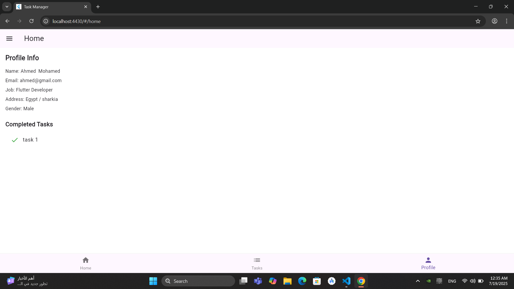

# My Flutter App (Ahmed Mohamed Abd Elhamed)

## سكرين شوت للمشروع 

### شاشة الترحيب :

### شاشه انشاء حساب :

### الشاشة الرئيسية :

### القائمة :

### شاشة المهمات :

### اضافة او حذف تاسك:

### شاشة البروفيل :

## التعديلات المطلوبة 

### اضافة تاب جديد المنشورات 

### صفحه المنشورات 

### البحث في المنشورات 

### صفحه المنشورات المفضلة 

### اضافة عدد المنشورات المفضلة و زر للتحويل لصفحتها في الملف الشخصي

